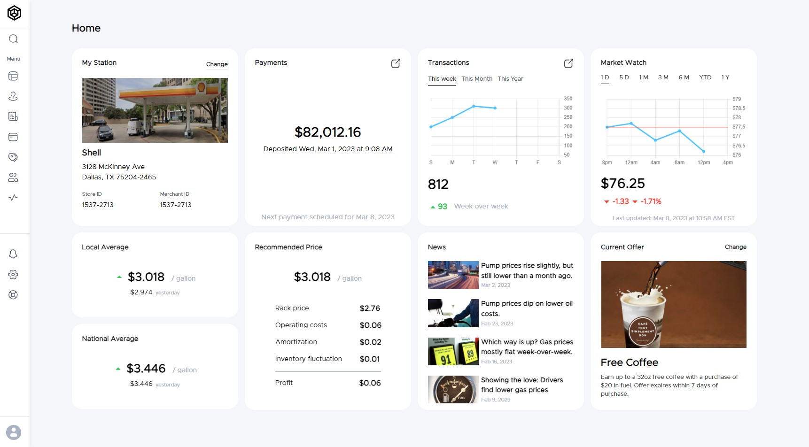
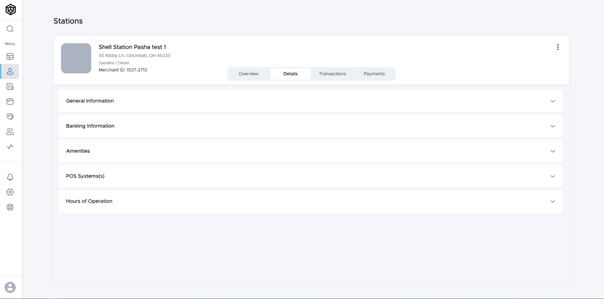
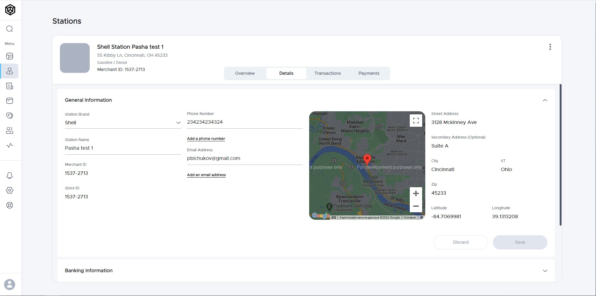
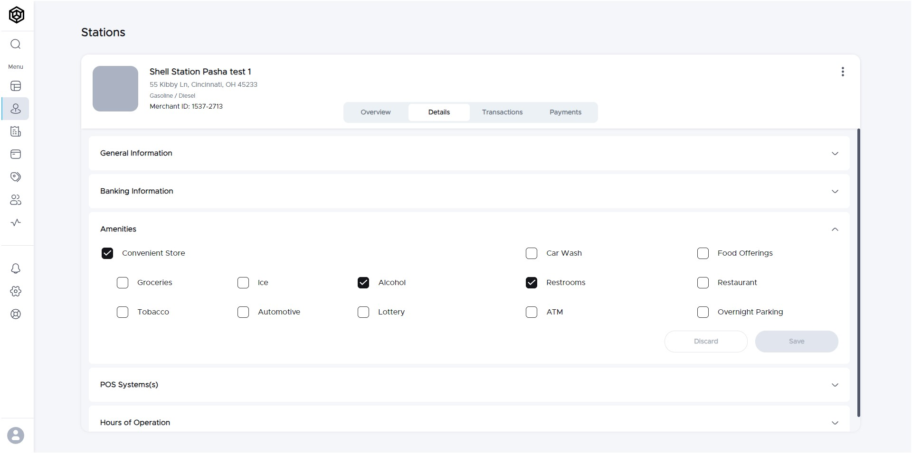
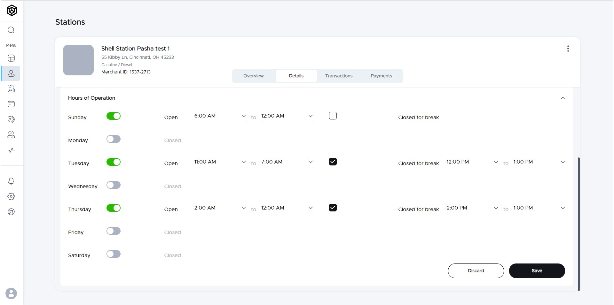
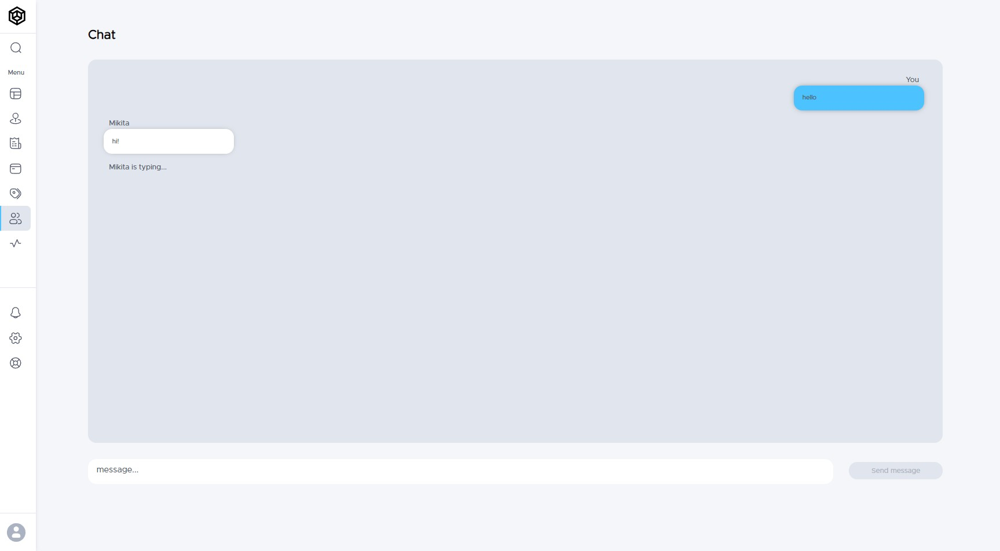
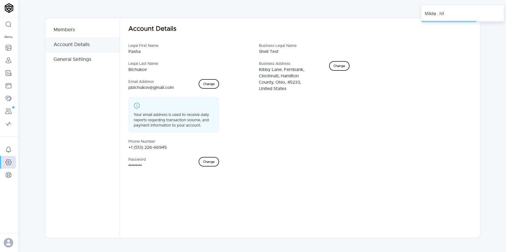

### JSLab

[DemoLink](https://jslabcom.netlify.app/)

---

## Description
JSLab - web applications for managing a chain of a gas stations.
 
 
## The application provides the user with the following features:

- Registration with further possibility of logging in after registration
- Changing the user data in personal account
- Adding stations
- Changing the configuration of a created station
- Ability to create members with a connection to a stations and
- Ability to create members with a connection to a stations and distribution of roles (regular user and administrator)
- Realtime chat with pop-up notifications

 

 

 

 

 

 

 

### :hammer_and_wrench: Languages and Tools :
- React / TypeScript / SCSS
- Redux Toolkit
- React Router DOM
- React Hook Form

